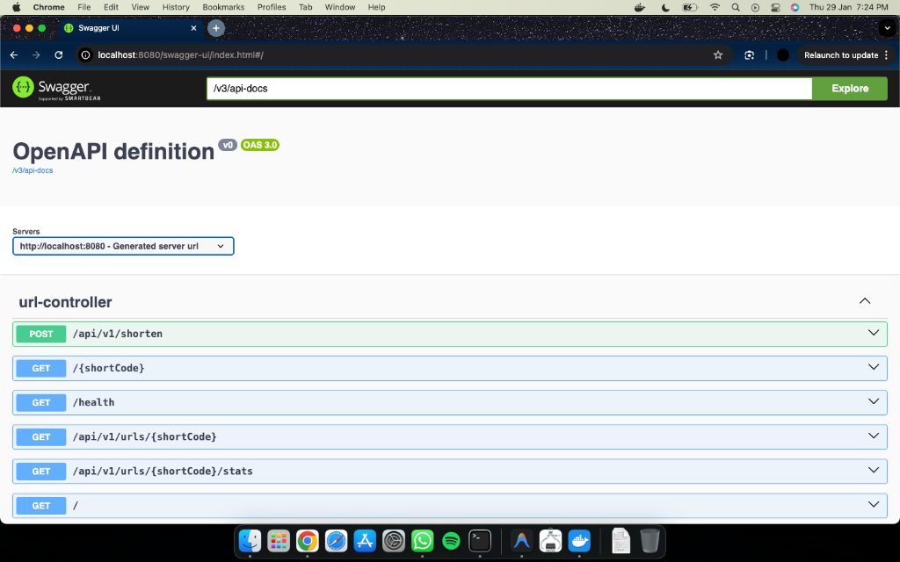
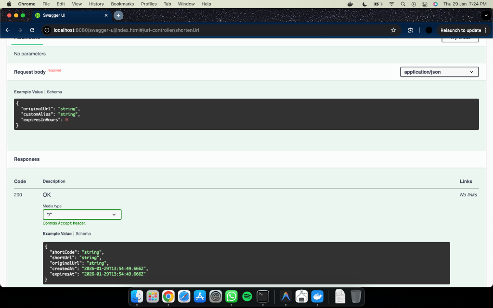

# High-Performance URL Shortener

**URL Shortener | Java, Spring Boot, Redis, PostgreSQL, Docker**

* Architected a scalable URL shortening service using Spring Boot 3.2, PostgreSQL, and Redis, integrating a GitHub Actions CI pipeline to automate build verification and enforce unit test execution prior to deployment.
* Designed a redirection layer using a cache-aside Redis strategy (24h TTL) to mitigate database read spikes and deliver sub-millisecond cache lookup latency via Redis for frequently accessed URLs.
* Developed a Base62 encoding mechanism supporting 56+ billion unique short URLs (6-character depth), validated through JUnit 5 and Mockito test suites covering controller, service, and utility layers to ensure logical correctness and edge-case handling.


[](https://github.com/Sasaank79/URL_Shortener/actions/workflows/maven.yml)

[](https://codespaces.new/Sasaank79/URL_Shortener?quickstart=1)

## Features

- **URL Shortening**: Convert long URLs to short, shareable links
- **Custom Aliases**: Create memorable custom short codes
- **Click Tracking**: Real-time click count statistics
- **URL Expiration**: Optional expiration for temporary links
- **Performance**: Sub-millisecond cache lookups via Redis
- **RESTful API**: Clean, documented REST endpoints (Swagger UI available locally)

## API Documentation

The application provides interactive API documentation via Swagger UI.


*Overview of available endpoints*


*Testing an endpoint directly from the browser*

## Architecture

```
┌─────────────────┐     ┌──────────────────┐     ┌────────────────┐
│   API Client    │────▶│  Spring Boot     │────▶│    Redis       │
│  (Browser/App)  │◀────│  REST API        │◀────│    Cache       │
└─────────────────┘     └──────────────────┘     └────────────────┘
                               │                        │
                               │    Cache Miss          │
                               ▼                        ▼
                        ┌──────────────────┐     ┌────────────────┐
                        │   PostgreSQL     │────▶│  Populate      │
                        │   Database       │     │  Cache         │
                        └──────────────────┘     └────────────────┘
```

### Key Design Decisions

| Component | Choice | Rationale |
|-----------|--------|-----------|
| **Encoding** | Base62 | 6 chars = 56B URLs, URL-safe characters |
| **Caching** | Redis | Sub-ms reads, 24h TTL for hot URLs |
| **Database** | PostgreSQL | ACID compliance, reliable storage |
| **Redirect** | 302 Found | Allows accurate click tracking |

## Quick Start

### Prerequisites

- Java 21 (LTS)
- Docker & Docker Compose

> **Note:** Maven is included via the Maven Wrapper (`./mvnw`) - no separate installation needed!

### 1. Start Infrastructure

```bash
# Start PostgreSQL and Redis
docker-compose up -d

# Verify containers are running
docker-compose ps
```

### 2. Run the Application

```bash
# Using Maven Wrapper (recommended)
./mvnw spring-boot:run

# Or build JAR and run
./mvnw clean package
java -jar target/url-shortener-1.0.0.jar
```

### 3. Test the API

```bash
# Create a short URL
curl -X POST http://localhost:8080/api/v1/shorten \
  -H "Content-Type: application/json" \
  -d '{"originalUrl": "https://www.google.com/search?q=very+long+url"}'

# Response:
# {
#   "shortCode": "1",
#   "shortUrl": "http://localhost:8080/1",
#   "originalUrl": "https://www.google.com/search?q=very+long+url"
# }

# Test redirect (follow redirects)
curl -L http://localhost:8080/1

# Get URL statistics
curl http://localhost:8080/api/v1/urls/1/stats
```

## API Reference

### Create Short URL

```http
POST /api/v1/shorten
Content-Type: application/json

{
  "originalUrl": "https://example.com/very/long/url",  // Required
  "customAlias": "mylink",                              // Optional
  "expiresInHours": 24                                  // Optional
}
```

**Response**: `201 Created`
```json
{
  "shortCode": "mylink",
  "shortUrl": "http://localhost:8080/mylink",
  "originalUrl": "https://example.com/very/long/url",
  "createdAt": "2024-01-15T10:30:00",
  "expiresAt": "2024-01-16T10:30:00"
}
```

### Redirect to Original URL

```http
GET /{shortCode}
```

**Response**: `302 Found` with `Location` header

### Get URL Statistics

```http
GET /api/v1/urls/{shortCode}/stats
```

**Response**: `200 OK`
```json
{
  "shortCode": "mylink",
  "shortUrl": "http://localhost:8080/mylink",
  "originalUrl": "https://example.com/very/long/url",
  "clickCount": 42,
  "createdAt": "2024-01-15T10:30:00",
  "expiresAt": "2024-01-16T10:30:00",
  "isExpired": false
}
```

## Testing

```bash
# Run all tests
./mvnw test

# Run with coverage
./mvnw test jacoco:report
```

## Configuration

Key configuration in `application.yml`:

```yaml
spring:
  datasource:
    url: jdbc:postgresql://localhost:5433/urlshortener
    username: postgres
    password: postgres

  data:
    redis:
      host: localhost
      port: 6379

app:
  base-url: http://localhost:8080
```

## Interview Talking Points

> **"Designed a URL shortener using Base62 encoding and Redis caching to support high read concurrency using Redis caching for sub-millisecond lookups."**

### System Design Highlights

1. **Base62 Encoding**
   - Maps database ID to short string
   - 6 characters = 56 billion unique URLs
   - Characters: `[0-9a-zA-Z]`

2. **Redis Caching**
   - Cache-aside pattern
   - 24-hour TTL for hot URLs
   - Sub-millisecond lookups

3. **Atomic Counters**
   - Uses database-level atomic increment operations
   - Thread-safe click tracking
   - Prevents lost updates under concurrent requests

4. **Clean Architecture**
   - Controller → Service → Repository
   - Separation of concerns
   - Testable design

## Project Structure

```
src/main/java/com/urlshortener/
├── UrlShortenerApplication.java   # Main application
├── config/
│   └── RedisConfig.java           # Redis configuration
├── controller/
│   └── UrlController.java         # REST endpoints
├── dto/
│   ├── ShortenRequest.java        # Request DTO
│   ├── ShortenResponse.java       # Response DTO
│   ├── UrlStatsResponse.java      # Stats DTO
├── entity/
│   └── Url.java                   # JPA entity
├── exception/
│   ├── GlobalExceptionHandler.java
│   ├── UrlNotFoundException.java
│   └── UrlExpiredException.java
├── repository/
│   └── UrlRepository.java         # JPA repository
├── service/
│   ├── UrlService.java            # Service interface
│   └── UrlServiceImpl.java        # Service implementation
└── util/
│   └── Base62Encoder.java         # Encoding utility
```

## License

MIT License - feel free to use this for learning and interviews!
